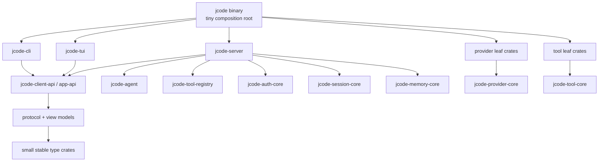

# Compile-Time Isolation Refactor

This is the active migration plan for making full-feature debug/selfdev builds faster without removing features from the developer binary.

## Goal

Keep the normal debug/selfdev binary production-like, including PDF, embeddings, providers, update/selfdev tooling, and other integrations, while reducing the amount of Rust code that must be recompiled after common edits.

The target is not just "more crates". The target is a wider dependency DAG with smaller serial front-end units and cleaner invalidation boundaries.

## Current diagnosis

The workspace already has many crates, but the critical path is dominated by a small number of large crates stacked linearly:


From the last available Cargo timing report parsed with `scripts/compile_time_probe.sh --skip-build`:

- Cargo timing wall: **16.00s**
- Known jcode serial stack span: **14.72s**
- Known jcode serial stack summed unit time: **17.36s**
- Known jcode serial stack frontend time: **11.99s**

Slowest units from that timing report:

| Unit | Total | Frontend | Codegen |
|---|---:|---:|---:|
| `jcode-app-core` | 4.73s | 3.82s | 0.91s |
| `jcode-base` | 4.34s | 3.63s | 0.71s |
| `jcode-tui` | 4.18s | 3.14s | 1.04s |
| `jcode` bin | 2.34s | n/a | n/a |
| `jcode` lib | 1.77s | 1.40s | 0.37s |

This means the main bottleneck is rustc front-end serialization in a few mega-crates, not linker choice or third-party cold compile.

## Measurement

Use the focused timing probe for each phase:

```bash
scripts/compile_time_probe.sh --json target/compile-time-probe.json
scripts/compile_time_probe.sh --touch crates/jcode-tui/src/tui/app/input.rs
scripts/compile_time_probe.sh --touch crates/jcode-app-core/src/server.rs
scripts/compile_time_probe.sh --touch crates/jcode-base/src/provider/mod.rs
```

For broader repeated measurements, continue using:

```bash
scripts/bench_compile.sh selfdev-jcode --runs 3 --touch <path> --json
scripts/bench_selfdev_checkpoints.sh --skip-cold --touch <path> --runs 1
```

Track at least:

1. Full-feature selfdev build wall time.
2. Cargo timing wall time.
3. `jcode-base -> jcode-app-core -> jcode-tui -> jcode lib -> jcode bin` stack span.
4. Sum of frontend time in the serial stack.
5. Incremental rebuild after touching representative high-churn files.
6. Static report drift from `scripts/compile_isolation_report.py`: LOC, inline tests, `async_trait`, and target-state dependency advisories.

## Target architecture



Rules:

- TUI and CLI depend on client API, protocol, view models, and small type crates, not full server/provider/tool implementations.
- Provider implementations are leaf crates. AWS/Bedrock dependencies live only in the Bedrock provider crate.
- Tool implementations are leaf crates. Heavy tools like PDF/browser/Gmail/search are isolated behind tool-core interfaces.
- Shared bottom crates are small and stable. Avoid putting high-churn behavior in protocol/type crates.
- Avoid broad `pub use whole_crate::*` compatibility ladders in final architecture.

## Migration sequence

### Phase 0: measurement and guardrails

Status: started.

Deliverables:

- `scripts/compile_time_probe.sh`
- `scripts/compile_isolation_report.py`
- this document
- dependency boundary checks/advisory reports

Success criteria:

- Every structural phase has before/after timing.
- The timing report makes the serial stack visible.

### Phase 1: widen the god-crate critical path

Split the three long-pole crates into sibling domain crates. Priority is widening the graph, not extracting more tiny type crates.

Likely first splits:

- From `jcode-base`:
  - `jcode-auth-core`
  - `jcode-session-core`
  - `jcode-memory-core`
  - provider implementation crates, especially Bedrock/AWS as a leaf
- From `jcode-app-core`:
  - `jcode-server`
  - `jcode-agent`
  - `jcode-tool-registry`
  - service crates for background/swarm/update/selfdev as needed
- From `jcode-tui`:
  - `jcode-client-api` / view-model boundary first
  - then move reusable client-side state logic out of the terminal rendering crate only when it creates a real parallel unit

Success criteria:

- Touching common TUI code no longer recompiles app-core/provider/server implementation crates.
- Touching a provider implementation no longer recompiles TUI or broad base code.
- Cargo timing shows multiple medium-sized Jcode crates running in parallel instead of one 4-deep mega-crate ladder.

### Phase 2: kill glob re-export ladders

Current compatibility layering preserves the old monolith shape:

```rust
pub use jcode_base::*;
pub use jcode_app_core::*;
pub use jcode_tui::*;
```

Migration approach:

1. Keep compatibility re-exports temporarily while moving code.
2. Convert high-churn modules to explicit imports from leaf crates.
3. Remove glob re-exports once downstream imports are explicit.

Success criteria:

- New code does not rely on whole-layer prelude-style re-exports.
- Dependency direction is visible in imports and Cargo manifests.

### Phase 3: move inline tests out of hot crates

Problem:

- Inline `#[cfg(test)]` modules make `cargo test` compile large production crates plus large test bodies as one rustc unit.

Target:

- Integration tests or dedicated `*-test-support` crates for broad behavior tests.
- Keep tiny unit tests inline only when they are genuinely local and cheap.

Success criteria:

- Targeted tests no longer require monolithic test cfg builds for unrelated domains.

### Phase 4: reduce front-end macro tax

Targets:

- Replace `async_trait` with native `async fn` in traits where the trait is not used as `dyn`.
- Keep `async_trait` only at object-safe plugin/interface boundaries where boxed futures are intentional.
- Avoid adding derive-heavy types to broad shared crates unless the type is stable and necessary.

Success criteria:

- Fewer proc-macro expansions in the hot crates.
- No object-safety regressions.

## Anti-goals

- Do not make fast debug builds incomplete by default.
- Do not split code into tiny crates unless the split creates a real invalidation or parallelism boundary.
- Do not move high-churn behavior into low-level type/protocol crates.
- Do not do a single giant rewrite. Each phase should build and be measurable.

## Validation checklist per phase

Before committing a phase:

```bash
scripts/compile_time_probe.sh --skip-build
scripts/compile_isolation_report.py
scripts/check_dependency_boundaries.py
cargo check --profile selfdev -p jcode --bin jcode
```

For code-moving phases, also run the relevant targeted tests for the moved domain, plus one full selfdev build through the coordinated selfdev path when practical:

```bash
selfdev build target=tui
```
