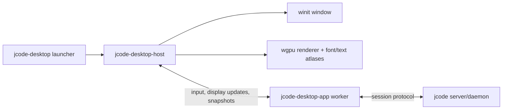

# Desktop Stable Host, Hot Reload, and Fast Startup Plan

Status: In progress
Updated: 2026-05-24

## Why this exists

The current desktop hot reload path starts a replacement `jcode-desktop` process. The replacement process creates a new `winit` window, waits behind a reload handoff marker, then the old process exits. This is enough to preserve session continuity, but it cannot reliably preserve the physical OS window.

On Wayland in particular, a client cannot count on restoring global window position, and a top-level window cannot be transferred from one process to another. That means a process-level desktop reload is inherently allowed to close/reopen or move the window.

The goal of this plan is to make the desktop architecture support:

- hot reload without replacing the OS window
- fast warm reloads during self-development
- better perceived cold starts
- a clean long-term split between platform/window/rendering, app logic, and server/session runtime

## Current desktop ownership model

Today `crates/jcode-desktop/src/main.rs` owns almost everything in one process:

```text
jcode-desktop process
  run()
    winit EventLoop<DesktopUserEvent>
    winit Window
    Canvas
      wgpu Surface / Device / Queue
      glyphon FontSystem / text atlases / render caches
      primitive and text render caches
    DesktopApp
      SingleSessionApp or Workspace
      local UI state
      session handles / async event channels
    DesktopHotReloader
      watches binary mtime
      spawns replacement process
```

Current reload flow:

1. `DesktopHotReloader` notices the binary changed or receives force reload.
2. It captures `window.outer_position()` and `window.inner_size()`.
3. It spawns a replacement process with reload placement and handoff marker env vars.
4. The new process creates a hidden window and initializes its canvas.
5. The new process writes a `ready` marker.
6. The old process writes a `release` marker and exits.
7. The new process makes its new window visible.

This is visually better than an immediate exit, but it is still a new OS window.

## Current startup critical path

The current startup trace marks these milestones:

```text
args parsed
winit event loop created
window created
app state initialized
font loader spawned
wgpu instance created
wgpu surface created
wgpu adapter selected
wgpu device ready
surface configured
canvas ready
first frame presented
first content frame presented
```

Important observations:

- The process does not enter the event loop until after `Canvas::new(...)` completes.
- `Canvas::new(...)` performs WGPU instance/surface/adapter/device setup.
- Font loading is already moved to a background thread, but text rendering still depends on the host-side font/text renderer once real content is drawn.
- Workspace session-card loading is asynchronous after startup, which is good.
- Server/session reloads already reconnect over sockets without closing the desktop window. The problematic reload is the desktop UI binary itself.

## Constraints

### Window identity

A persistent window requires a persistent process that owns that window. The TUI can `exec()` because the terminal emulator owns the OS window. The desktop process owns its own OS window, so `exec()` or spawning a replacement destroys the top-level window.

### Wayland

Wayland does not provide reliable global window positioning or cross-process top-level window transfer. Any solution that depends on setting `x,y` on a new window will remain best-effort.

### Rust dynamic plugins

Loading desktop UI code as a Rust dynamic library could keep the process/window alive, but it is high risk as a first step:

- Rust has no stable plugin ABI for rich internal types.
- Unloading code safely is difficult with threads, statics, allocators, GPU handles, and panic/runtime state.
- Compiler/version mismatches can crash rather than fail gracefully.
- The boundary would need to be C-ABI-like or explicitly serialized anyway.

Dynamic plugins can be revisited later, but a process boundary is safer and easier to test.

## Architecture options

| Option | Window survives UI reload? | Cold-start benefit | Risk | Notes |
|---|---:|---:|---:|---|
| Keep current process handoff | No | None | Low | Cannot solve Wayland movement. |
| Desktop `exec()` like TUI | No | None | Low | Process image changes, but the OS window still dies. |
| Dynamic library plugin | Yes | Medium | High | Fastest theoretical reload, but ABI/unload hazards. |
| Stable host + reloadable app worker + display-list protocol | Yes | High perceived benefit | Medium | Recommended. |
| Stable host + child renders pixels offscreen | Yes | Medium | High | More bandwidth/GPU sharing complexity, less flexible. |

## Recommended design

Introduce a small stable desktop host that owns platform and rendering resources. The reloadable desktop app code runs behind a protocol boundary.



### Stable host responsibilities

The host should own the things that must not disappear during a UI reload:

- OS window and event loop
- WGPU instance/device/queue/surface
- font system and glyph/text atlases
- image atlases and primitive buffers
- clipboard/platform adapters where practical
- app-worker lifecycle and restart policy
- last known UI snapshot for reload handoff
- immediate boot/splash/error UI

The host should be intentionally small and stable. Most product UI behavior should not live here.

### Reloadable app worker responsibilities

The worker should own product logic that we want to iterate on quickly:

- workspace/single-session reducers
- command handling
- layout decisions
- markdown/transcript shaping decisions at a logical level
- session/server protocol client
- view-model construction
- surface-local UI state, with snapshot export/import

The worker does **not** own the OS window. If it exits or is replaced, the host keeps showing the last committed frame, an overlay like “reloading UI…”, or a host-rendered fallback.

### Host/worker protocol

Start with a typed, versioned, local-only protocol over a Unix domain socket or inherited stdio pipes. JSON is fine for the first prototype because debuggability matters; switch to bincode/postcard only if measurements require it.

Minimum message families:

```text
Host -> Worker
  Init { protocol_version, window_size, scale_factor, restored_snapshot }
  Input { key/mouse/scroll/text/clipboard/drop }
  Window { resized, scale_factor_changed, focus_changed }
  Tick { now, animation_budget }
  Command { reload_requested, shutdown_requested }

Worker -> Host
  Ready { capabilities }
  Frame { display_list, title, cursor, animation_state }
  Patch { display_list_delta }
  Snapshot { opaque_versioned_state }
  Request { clipboard_read, clipboard_write, open_url, spawn_terminal }
  Log / Error / Panic
```

The first implementation can send full frames. Add diffing once frame sizes are known.

### Display-list boundary

The host should render a semantic display list rather than pixels.

A useful first display list can include:

- rectangles, rounded rectangles, borders, rules
- text boxes with font family, size, color, wrap width, selection ranges
- image references
- clips/layers/transforms
- hit-test IDs/accessibility labels later

This keeps GPU, glyph, and image caches in the persistent host while letting worker code change layout and UI behavior. Text shaping can remain host-side for cache reuse: the worker says “draw this text in this box with these styles”, and the host shapes/renders it.

## Startup strategy

The same host architecture can improve startup if we treat the host as a fast shell, not merely as a reload wrapper.

### Cold start from no running processes

A true cold start still must pay for process launch and window creation. It should **not** have to block window visibility on WGPU device initialization.

The host should have a staged startup model:

```text
WindowHost phase
  create event loop/window
  make the OS window visible quickly
  optionally draw a native/CPU/blank splash
  start WGPU initialization asynchronously
  start app-worker/server/session loading asynchronously

GpuHost phase
  WGPU surface/device/queue ready
  swap in the real renderer
  draw cached snapshot or latest worker scene

LiveApp phase
  worker ready
  server/session state caught up
  normal display-list rendering
```

This separates three different metrics that are currently coupled:

- **time to window visible**: should not wait for WGPU
- **time to first host pixels**: can use a no-GPU/native/CPU fallback if worthwhile
- **time to first real GPU content**: still depends on WGPU init

We can improve perceived and measured startup by:

1. Keeping the host binary small.
2. Creating and showing the window before loading product/session state.
3. Not blocking the host event loop on `Canvas::new(...)` / WGPU setup.
4. Starting WGPU init, app-worker launch, server connection, font loading, and session-card loading in parallel.
5. Drawing a host-owned GPU boot frame as soon as the WGPU surface is configured.
6. Showing a cached workspace/session snapshot immediately while live data catches up.
7. Lazily creating expensive text/image renderer resources on first real use.
8. Avoiding synchronous disk scans on the UI thread.

Target cold-start sequence:

```text
host process starts
  parse minimal host args
  create event loop/window
  show window immediately
  enter event loop
  start worker process asynchronously
  start/attach server asynchronously
  start WGPU init asynchronously
  optionally show no-GPU/native/CPU splash
  WGPU ready -> paint host GPU boot frame
  load cached UI snapshot
  receive worker Ready/Frame
  replace boot frame with live UI
```

### No-GPU boot phase

The host does not need to construct WGPU before it owns a window. Treat WGPU as a renderer backend that can appear later.

Implementation shape:

```rust
enum HostRendererState {
    NoGpuBoot,
    GpuInitializing,
    GpuReady(Canvas),
    GpuFailed { message: String },
}
```

In `NoGpuBoot`, the host can choose one of three fallback strategies:

1. **Blank visible window**: fastest and simplest, but may look unfinished.
2. **Native/platform splash**: use platform APIs where practical. Fast, but less portable.
3. **CPU framebuffer splash**: use a tiny software path such as `softbuffer` for a basic solid background/logo/status. More portable than native drawing, but adds another rendering backend.

The first implementation should probably start with a blank or minimal native-color visible window and metrics. Add a CPU splash only if measurements show a real user-visible gap worth covering.

The important rule is that WGPU readiness should upgrade the renderer in place; it should not recreate the OS window.

### User-perceived cold starts with a resident host

For the fastest user-visible launch, add an optional linger/autostart host:

- `jcode-desktop-host --daemon` starts at login or after first launch.
- It keeps WGPU device, font DB, and maybe recent workspace snapshot warm.
- Opening the app asks the resident host to show/create a window.
- The daemon exits after an idle timeout if low idle resource use is preferred.

This is not a true machine-cold start improvement, but it is the common “I opened the app and it appeared instantly” path.

### Warm reload

On app-worker reload:

1. Host asks old worker for a snapshot.
2. Host keeps the existing frame visible and overlays “Reloading UI…”.
3. Host starts the new worker binary.
4. New worker receives the snapshot and reconnects to the server/session.
5. New worker sends `Ready` and then a new `Frame`.
6. Host swaps to the new frame without moving or hiding the OS window.

If the new worker fails, the host keeps the old frame or a host-rendered error UI and can retry.

## Incremental migration plan

### Phase 0: measurement first

Add or preserve metrics for:

- process start to window created
- process start to window visible / event loop entered
- process start to WGPU init started
- process start to surface configured / WGPU ready
- process start to first no-GPU host pixels, if a fallback renderer exists
- process start to first GPU host frame
- process start to first live worker content frame
- reload blackout duration
- worker restart duration
- display-list bytes per frame
- input event to presented frame latency

The existing `--startup-log`, `--startup-benchmark`, and frame profiler are a good base. Extend them instead of inventing a second measurement system.

### Phase 1: display-list extraction in-process

Before adding IPC, make the current renderer consume a display-list-like structure instead of directly reading `DesktopApp` everywhere.

Expected outcome:

```text
DesktopApp + layout code -> DesktopScene / DisplayList -> Canvas::render_scene(...)
```

This is the safest first refactor because tests can compare current rendering behavior while creating the boundary the host/worker protocol will need.

### Phase 2: app-driver trait in-process

Introduce an internal boundary like:

```rust
trait DesktopAppDriver {
    fn handle_input(&mut self, input: DesktopInputEvent) -> Vec<DesktopHostCommand>;
    fn handle_session_events(&mut self, events: Vec<DesktopSessionEvent>) -> Vec<DesktopHostCommand>;
    fn build_scene(&mut self, viewport: DesktopViewport) -> DesktopScene;
    fn snapshot(&self) -> DesktopUiSnapshot;
    fn restore(&mut self, snapshot: DesktopUiSnapshot);
}
```

Initially, the existing `DesktopApp` implements this in the same process.

### Phase 3: host mode and worker mode

Add two modes, possibly in the same binary first:

- `jcode-desktop --host`
- `jcode-desktop --app-worker --ipc <fd-or-socket>`

The host owns the current `run()` window/event loop/canvas path. The worker owns the app driver and session protocol. Use a socket/stdio protocol to pass inputs and display-list frames.

### Phase 4: worker hot reload

Change `DesktopHotReloader` so the host watches the worker binary and restarts only the worker. The host process and OS window remain alive.

Host binary reload can remain the current process handoff path because host changes should be rarer.

### Phase 5: split crates/binaries

Once the protocol is real, split into clearer crates/binaries:

```text
crates/jcode-desktop-protocol   # host/worker messages and scene types
crates/jcode-desktop-renderer   # Canvas/rendering/display-list renderer
crates/jcode-desktop-host       # window/event loop/worker lifecycle
crates/jcode-desktop-app        # product UI worker
crates/jcode-desktop            # launcher or compatibility wrapper
```

This also supports cold-start optimization because the host can stay small and stable while app code grows.

## Risks and mitigations

### Display-list size and IPC overhead

Mitigation: start with full frames and measure. Add scene hashes, retained nodes, and patches only after we have real data.

### State loss on reload

Mitigation: define `DesktopUiSnapshot` early. Include draft text, focus, scroll offsets, selected session/surface, workspace placement, and pending local UI state. Keep it versioned and best-effort so incompatible snapshots fail gracefully.

### Protocol skew

Mitigation: explicit protocol version and capabilities. If a new worker is incompatible, the host shows a clear error and offers to restart the whole desktop app.

### Too much logic in the host

Mitigation: host owns platform/rendering/lifecycle only. If a behavior is product-specific and safe to reload, it belongs in the worker.

### Startup daemon resource use

Mitigation: make resident host optional, idle-timeout based, and measurable. Keep default behavior on-demand until data shows the daemon is worth it.

## Recommended MVP

The smallest useful MVP is not a separate process yet. It is:

1. Define `DesktopScene` / display-list types.
2. Refactor `Canvas::render(&DesktopApp, ...)` into `Canvas::render_scene(&DesktopScene, ...)` while still building the scene in-process.
3. Add startup/reload metrics around scene building and first host frame.
4. Add `DesktopUiSnapshot` types for the state we need to preserve.

After that, moving the scene builder into a worker process becomes a mechanical host/worker transport problem instead of a giant UI rewrite.

## Bottom line

For reloads that never move the window, we need a stable window owner. For faster starts, that stable owner should also be a small fast shell that can draw immediately, keep expensive renderer resources warm, and load product/session logic asynchronously.

The recommended path is a stable `jcode-desktop-host` plus a reloadable `jcode-desktop-app` worker communicating via a typed display-list protocol. It avoids Wayland window-position limitations, avoids Rust plugin ABI hazards, and creates a natural path to both smooth hot reloads and better perceived cold-start performance.

## Current implementation snapshot

As of 2026-05-24, the first stable-host slice exists in the current `jcode-desktop` binary:

- WGPU/canvas initialization is spawned after the `winit` window is created, so the event loop can enter before GPU setup finishes.
- `DesktopScene`, `DesktopUiSnapshot`, host/worker protocol messages, JSON-lines IPC framing, and protocol-version validation are in place.
- `--desktop-process-role stable-host` owns the OS window and renderer and starts a headless `app-worker` child process.
- Stable-host reload uses `DesktopReloadStrategy::AppWorkerRestart`, killing/restarting only the app worker while the host window stays alive.
- The app worker initializes a real `DesktopAppRuntime`, restores the host snapshot, applies key/session IPC events, and emits updated scenes back to the host.
- The host renders worker-produced scenes through `Canvas::render_scene(...)` when available.

Validation performed for this slice:

- `cargo test -p jcode-desktop desktop_`
- `cargo check -p jcode-desktop`
- `selfdev build target=desktop`
- runtime smoke: `cargo run -p jcode-desktop --bin jcode-desktop -- --desktop-process-role stable-host --startup-benchmark --startup-log`

## Crate-split and cold-start assessment

The next split should not be a separate binary yet. The code is functionally split, but `crates/jcode-desktop/src/main.rs` is still a large 10k+ line compilation unit that imports both heavy renderer dependencies (`wgpu`, `glyphon`) and app/session logic. Splitting crates before moving more code out of `main.rs` would add build-system complexity without materially reducing cold-start work.

Recommended order:

1. **Module split inside `jcode-desktop` first.** Move stable-host/window/reload code, worker-process loop, and canvas/rendering code out of `main.rs` into focused modules. This reduces merge conflicts and makes crate boundaries obvious without changing packaging.
2. **Promote protocol and scene types to a small crate.** `desktop_protocol`, `desktop_scene`, and IPC framing are already mostly independent. A future `jcode-desktop-protocol` crate can compile quickly and be shared by host and worker without pulling WGPU.
3. **Create a host binary only after the host module no longer depends on app reducers.** The host binary should depend on `winit`, `wgpu`, `glyphon`, protocol/scene types, and worker lifecycle only. It should not depend on session reducers except for versioned snapshots and host fallback/error UI.
4. **Create an app-worker binary after product UI state is behind `DesktopAppDriver`.** The worker binary should own `SingleSessionApp`, `Workspace`, session/server integration, and scene construction. It should not link WGPU or glyph atlases.
5. **Measure before adding a resident daemon.** A resident host can make user-perceived launch nearly instant, but it also adds idle memory/GPU cost. Add it only after we have startup metrics for cold host process, WGPU readiness, worker ready, and first live scene.

Expected cold-start impact:

- **On-demand cold start:** splitting crates/binaries mainly helps by keeping host initialization small and allowing worker/app loading to happen in parallel. It does not remove WGPU cost for first GPU pixels.
- **Perceived cold start:** the stable host can show the window immediately and keep a boot/cached frame visible while WGPU and worker startup race in parallel.
- **Warm/reload start:** this is where the architecture already wins. The host keeps the window and renderer alive, and only the worker restarts.

Current recommendation: defer physical crate split until the host/worker modules are cleaner and the debug-socket E2E reload test is in place. The next best engineering step is stronger end-to-end validation, not more crate boundaries.
