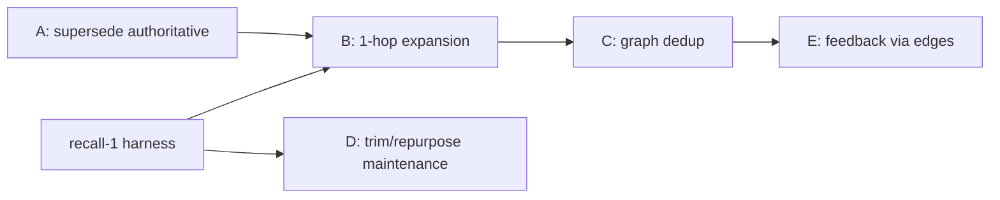

# Plan: Making the Memory Graph Earn Its Keep

> Status: Proposal. Companion to MEMORY_ARCHITECTURE.md. Goal: best recall accuracy.

## Current reality (verified in code)

- **Live automatic recall** (`memory_agent::process_context`) uses
  `find_similar_with_embedding` -> `score_and_filter`: flat cosine over all
  active memories, threshold 0.5, gap filter, top 10, then per-candidate binary
  sidecar relevance, max 5 surfaced.
- The **graph traversal** (`cascade_retrieve`, BFS over tags/clusters/RelatesTo)
  is only called by the manual `memory { action: search }` tool
  (`tool/memory.rs:216`). It contributes **nothing** to per-turn surfacing.
- Maintenance (`post_retrieval_maintenance`) WRITES graph structure every turn
  (RelatesTo links, auto-clusters + sidecar naming, inferred tags, confidence
  boost/decay, pruning) but the live path never READS most of it back.

So today the graph's edges/clusters/tags are write-mostly. The parts that
matter (supersede/contradiction -> `active`, reinforcement strength, confidence
gating the active set) help data hygiene, not ranking.

## Goal: maximize recall accuracy in BOTH modes

Both modes are first-class targets. They share Stage 1 (candidate generation)
and the graph layer, but diverge at the quality/judgment stage. Strategy:
push as much accuracy as possible into the **shared local stack** (better
embedder, hybrid, query construction, graph rerank, priors) so Mode 1 gets
strong on its own, then let Mode 2's LLM add a final precision layer on top of
an already-good candidate set rather than compensating for a weak one.

### Shared local stack (lifts both modes)
- recall-2 better embedder + asymmetric prefixes
- recall-3 focused query construction (current intent, not 8k blob)
- recall-4 hybrid dense + BM25 + RRF
- recall-6 recency/confidence/strength/scope priors in the score
- Phases A-C graph: supersede-authoritative, 1-hop expansion, dedup
- A local cross-encoder reranker (small, on-device) as the Mode 1 top stage

### Mode 1 (no LLM) - get it as close to Mode 2 as possible
- Replace raw-cosine top-5 with: hybrid recall -> graph expansion -> local
  cross-encoder rerank -> priors -> calibrated cutoff. No LLM needed for any of
  this; a cross-encoder is the single biggest precision lever available offline.
- Tune the calibrated cutoff per-mode (Mode 1 can afford slightly higher recall
  since there's no LLM filter downstream; rely on the cross-encoder for precision).
- Optional: cheap local query expansion (synonyms/identifier splitting) since
  there's no LLM to do query rewriting.

### Mode 2 (LLM) - add precision, don't redo recall
- Feed the SAME strong candidate set (hybrid + graph + cross-encoder top ~15-20)
  into one **listwise** LLM rerank, replacing today's independent binary calls
  (binary calls can't compare candidates and waste the LLM's judgment).
- Use the LLM for query rewriting / HyDE at Stage 0 to fix hard recall misses
  that the local stack can't reach.
- Keep the LLM as the final arbiter for contradictions and ambiguous relevance.

### Why this converges both
Mode 1 ceiling rises to "best offline retriever + cross-encoder" (very high).
Mode 2 starts from that same ceiling and adds LLM rewriting + listwise judgment,
so it's strictly >= Mode 1. The harness (recall-1) tracks both columns each
change so neither regresses.

## Two operating modes (gate: `agents.memory_sidecar_enabled`, env `JCODE_MEMORY_SIDECAR_ENABLED`, default off)

The system runs in two distinct modes; recall behavior differs substantially.

### Mode 1 - Sidecar OFF (embedding-only, no LLM)
- Surfacing (`evaluate_candidates`): skips LLM, takes top candidates by **raw
  cosine** (up to 5). No relevance verification, no listwise judgment.
- Extraction: `extract_from_context` + final extraction are **skipped**. Memories
  are created ONLY via the explicit `memory` tool, not auto-learned.
- Cluster naming: falls back to `infer_candidate_tag` (heuristic, no LLM).
- Net: fully local, zero LLM cost; weakest precision (no filtering) and no auto
  memory growth.

### Mode 2 - Sidecar ON (LLM-assisted)
- Surfacing: per-candidate binary relevance check by sidecar LLM (parallel, max 5).
- Extraction: auto-extract on topic change + every 12 turns + session end, with
  LLM dedup/contradiction checks.
- Maintenance: LLM-named clusters, contradiction detection.

### Implications for this plan
- Every recall improvement must be evaluated in BOTH modes (recall-1 harness
  should report two columns).
- Phases A-C (graph as reranker/dedup/expansion) are **pure local** and benefit
  Mode 1 the most, since Mode 1 currently has no quality layer beyond cosine.
- recall-5 (rerank) has two implementations: a local cross-encoder path for
  Mode 1, and the listwise LLM rerank for Mode 2 (replacing today's binary calls).
- Phase D maintenance trimming primarily affects Mode 2 cost (cluster naming is
  the LLM line item); Mode 1 already uses the heuristic fallback.

## Edge types and what each is good for

| Edge          | Source of truth | Use in recall |
|---------------|-----------------|----------------|
| `Supersedes`  | contradiction/dedup on write | Keep ONLY newest version in results; demote/hide superseded |
| `Contradicts` | sidecar on write | Surface both + flag conflict; never silently pick one |
| `RelatesTo`   | co-relevance maintenance | 1-hop expansion to rescue near-misses |
| `DerivedFrom` | co-extraction | 1-hop expansion (procedures <-> facts) |
| `HasTag`      | user + inference | Lexical/filter signal, scope narrowing |
| `InCluster`   | auto clustering | Weakest; diversity/dedup at best |

## Design principle

Use the graph as a **structural reranker / recall-rescue layer**, NOT as the
primary retriever. Embeddings (+ future hybrid) generate candidates; the graph
re-scores and expands them. This is where graphs reliably help in RAG: relating,
deduping, and rescuing, not first-stage recall.

## Target live pipeline

```
Stage 1  Candidate generation (existing + future hybrid)
          dense cosine (and later BM25 + RRF), generous top-N (~40)

Stage 2  Graph expansion (NEW, 1-hop only)
          for each seed, pull neighbors via Supersedes / RelatesTo / DerivedFrom
          score_neighbor = seed_score * edge_weight * depth_decay
          this rescues relevant memories that embedding alone missed

Stage 3  Graph-aware dedup/canonicalize (NEW)
          collapse Supersedes chains -> keep newest active only
          group near-duplicate cluster members -> representative + count

Stage 4  Rerank + priors (ties into recall-5 / recall-6)
          listwise rerank, then fold confidence / strength / recency / scope
          apply calibrated cutoff
```

## Phased plan

### Phase A - Make supersede/contradiction authoritative in live recall (cheap, high value)
- In `score_and_filter` / `process_context`, post-filter results through the
  graph: drop any memory whose `superseded_by` is set or that has an incoming
  `Supersedes` edge from an active memory.
- Surface `Contradicts` pairs together with a conflict flag instead of letting
  raw cosine arbitrarily pick one.
- Verifiable: unit test with a superseded chain; assert only newest surfaces.

### Phase B - Wire 1-hop graph expansion into the live path
- Add a `cascade=true` mode to the live retrieval (reuse `cascade_retrieve` but
  cap depth=1 and restrict edges to Supersedes/RelatesTo/DerivedFrom; exclude
  InCluster/HasTag fan-out which explode candidate count).
- Feed expanded set into the reranker, not directly to output.
- Verifiable (needs recall-1 harness): recall@5 with vs without expansion.

### Phase C - Graph-aware dedup before surfacing
- Collapse Supersedes/near-dup cluster members so the 5 surfaced slots aren't
  wasted on restatements of one fact. Improves effective precision and recall.

### Phase D - Decide the fate of expensive maintenance
- Auto-clustering + sidecar cluster-naming + tag inference currently cost LLM
  calls + full graph save per cycle and feed nothing into live recall.
- Options:
  1. Repurpose clusters for Phase C dedup/diversity (keeps them, drops naming).
  2. Cut cluster-naming + tag-inference entirely, redirect budget to embedder
     upgrade + hybrid + rerank (recall-2/4/5).
- Recommended: cut naming + tag-inference now; keep cluster centroids only if
  Phase C uses them. Keep confidence boost/decay, supersede, reinforcement.

### Phase E - Feedback loop closes via graph
- On inject + actual use, reinforce surfaced memories and strengthen the
  RelatesTo edges among co-used memories (already partly there). Once Phase B
  reads those edges, this feedback finally affects future recall.

## Cost to quantify first (before Phase D decision)
- Per maintenance cycle: # sidecar LLM calls (cluster naming), # graph load+save
  round-trips, bytes rewritten. Add a counter / log and measure on the real
  `~/.jcode/memory` graphs.

## Dependencies / ordering
- recall-1 (eval harness) gates B/C/D measurement.
- Phase A is independent and safe to do first (pure correctness win).
- Phases B/C should be measured against the harness; otherwise we're guessing.


## Implementation status (2026-06-14)

Benchmark (Mode 1, private ~/jcode-memory-bench, Sonnet judge):
- DONE: harness `memory_recall_bench` (queries/pool/judge/metrics), committed.
- Baseline: production dense (0.5 thr) = 0.0 recall@5; hybrid = 0.53.

Shipped to live path:
- DONE recall-0 + recall-4: memory agent uses `find_similar_hybrid`
  (dense + BM25 + RRF, no cosine floor). Removed the recall-killing 0.5 threshold
  and added lexical signal. Unit tests added. Bench: 0.0 -> 0.53 recall@5.

Evaluated, NOT shipped:
- recall-6 priors: roughly neutral (+1.8pt r@5 / -1.8pt r@10). Held back; bench
  config `hybrid_priors` retained for re-evaluation after embedder upgrade.

Next (high value, larger change):
- recall-2: embedder upgrade (dense half is weak at 0.17 unthresholded).
- recall-3: focused query construction (window concatenates up to 12 msgs +
  tool output; ~19% carry system-reminder boilerplate).
- recall-5: rerank stage. graph A-D: graph utilization.

## Update 2026-06-14 (rerank breakthrough, multi-agent)

Benchmark-driven results (Sonnet judge, 28 judged queries, jcode self-dev corpus):
| Config       | recall@5 | recall@10 | precision@5 | MRR   |
|--------------|----------|-----------|-------------|-------|
| baseline (prod dense, 0.5 thr) | 0.000 | 0.000 | 0.000 | 0.000 |
| hybrid (SHIPPED)               | 0.530 | 0.679 | 0.229 | 0.504 |
| ce_rerank (local CE, rejected) | 0.325 | 0.420 | 0.129 | 0.322 |
| llm_rerank (listwise Sonnet)   | 0.754 | 0.832 | 0.346 | 0.762 |
| oracle ceiling                 | 0.990 | 1.000 | 0.443 | 1.000 |

- Hybrid (dense+BM25+RRF) shipped: 0.0 -> 0.53 recall@5.
- Local cross-encoder REJECTED (out-of-distribution, 0.325).
- Listwise LLM reranker over the hybrid top-50 with a FOCUSED query: 0.53 -> 0.75
  recall@5, captures most of the oracle headroom. This is the Mode-2 path.
- Embedder upgrade de-prioritized (pool recall already ~99%; bge anisotropic).

Implementation split (turtle + crocodile):
- Shared: jcode-base/src/memory_rerank.rs (prompt + parse + rerank_candidates),
  used by both bench and memory_agent (single source of truth).
- memory_agent process_context: Mode-2 reranks hybrid candidates with the focused
  query before surfacing; Mode-1 unchanged (no adequate local reranker).
- Focused query builder (focus_query_text) lands in memory_prompt.rs.

## Deferred follow-ups (2026-06-14, after the rerank pipeline shipped)

The two-stage pipeline (hybrid retrieve -> focused-query listwise LLM rerank ->
top-5) is live and committed; production recall@5 went 0.0 -> 0.53 -> ~0.75.
These remain as future work, each blocked or deliberately deprioritized:

1. **Remote embedding adapter** (low value, measure first). EmbeddingBackend
   trait + LocalOnnxBackend scaffolding is shipped (embedding_backend.rs). A
   remote openai/openai-compatible adapter + auto-select-on-embeddings-key +
   re-embed migration would plug in via `active_backend()`. Deprioritized because
   the oracle-ceiling analysis showed the embedder is a *capped* lever (the
   candidate pool already contains ~99% of relevant memories; ranking, not
   recall of the pool, was the bottleneck). Only revisit if a future change makes
   the base embedder the bottleneck again, and A/B it in the bench first.

2. **Live reload + Mode-2 verification** (user action). Build+reload onto the new
   binary and confirm the rerank fires in a real session (memory logs should show
   the single listwise rerank instead of per-candidate sidecar checks). Pending
   only because the shared worktree currently has an unrelated agent's
   uncommitted changes; not a code issue.

3. **GPT-5.5 judge re-run** (blocked ~18 days). Re-run the bench LLM judge with
   GPT-5.5 (`--backend=openai --reasoning=none`) once the OpenAI account quota
   resets, and compare judge agreement against the current Claude-Sonnet gold
   labels. Infrastructure is already in place (Sidecar::with_openai_model).

## Fork-the-judge / KV-reuse reranker (validated design, future)

Idea (user, 2026-06-14): instead of a separate tiny sidecar call for the memory
rerank, reuse the main agent's warm transcript KV cache and run the reranker as
a branch off it, so the judge's marginal cost is just the rerank suffix.

Benchmark findings (claude-sonnet-4-6, 28 judged queries, see
~/jcode-memory-bench/results/BASELINE_SUMMARY.md):
- Naive (full transcript as the rerank query): QUALITY REGRESSION. recall@5
  0.81 -> 0.58, precision@5 0.34 -> 0.25. Noise dilutes even a frontier model.
- prefix_suffix (full transcript as prefix + focused intent appended as a
  suffix with a "focus on THIS" marker): FULLY RECOVERS quality. recall@5 0.811,
  precision@5 0.351, MRR 0.784 (>= the shipped focused-query rerank).

Conclusion:
- The cache-friendly structure (transcript-as-prefix for KV reuse) does NOT cost
  accuracy *if* the focused rerank instruction is appended as a suffix.
- SELF-HOSTED (vLLM/SGLang/Ollama): viable + high-quality. Fork the rerank
  sequence off the agent's warm transcript KV (SGLang fork / RadixAttention),
  append the focused rerank suffix + candidate list, decode a short ranked list.
  Near-free, full-model-quality reranking. Good basis for a local/premium memory
  path. Requires a server that exposes prefix sharing/forking.
- PROVIDER APIs (default): NOT a cost win (cached-read on a ~50k-token transcript
  prefix still costs ~10-20x a ~1k focused sidecar prompt, because the big
  model's per-token rate dominates), but no longer a quality regression. Could be
  exposed as an opt-in config "rerank with main model + prompt caching" for users
  who prioritize rerank quality and have caching enabled. Default stays the cheap
  focused-query sidecar, which wins on both cost and quality on the API path.

Bench repro: `memory_recall_bench metrics --config=llm_rerank
--query_view=focused|full|prefix_suffix --model=<model>`.
